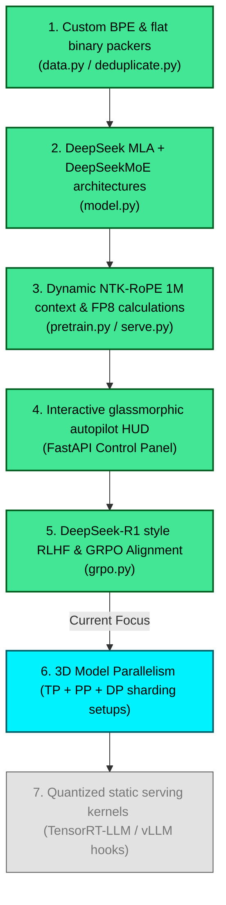

# Contributing to nano-llm

First off, thank you for considering contributing to **nano-llm** (upgraded with **nano-deepseek**)! It is people like you who make this codebase a spectacular resource for the deep learning community.

---

## 🗺️ Visual Project Roadmap & Future Milestones

We welcome contributions across all areas of the project. Here is our current development roadmap:



---

## 🛠️ Contribution Guidelines

To keep the repository highly clean, academic, and high-performance, we maintain four core guidelines:

1. 🧠 **Zero Heavy Abstractions**
   * Keep SFT, DPO, and Pre-training loops written in **explicit, pure PyTorch**.
   * Avoid wrapping code in thick, black-box libraries (like Hugging Face Trainer, DeepSpeed, or Megatron). All operations should be traceable.

2. 🏎️ **Hopper & NVIDIA Optimization**
   * Prioritize dynamic FP8 calculations, Fused AdamW kernels, and PyTorch Activation Checkpointing hooks.
   * Make sure memory-mapped datasets are loaded using fast NumPy pointers to bypass CPU overhead.

3. 📐 **Theoretical Rigor**
   * Ensure that mathematical algorithms (such as low-rank Multi-Head Latent Attention compression, SwiGLU gated FFNs, and NTK positional stretching) are represented accurately.

4. 🎨 **Visual-First Documentation**
   * If you are modifying architectures, please update the corresponding visual markdown blueprints in `docs/` using **Mermaid diagrams**. 
   * Avoid adding large blocks of text; represent processes visually!

---

## 🚀 Getting Started with Pull Requests

1. **Fork the repository** on GitHub.
2. **Create a feature branch** from `main` (`git checkout -b feature/your-awesome-upgrade`).
3. **Write and verify your changes**:
   * Run the test suite to ensure compile and logic success:
     ```bash
     python -m unittest tests/test_model.py
     python -m unittest tests/test_data.py
     ```
4. **Commit with descriptive messages** following Conventional Commits (e.g. `feat: add GRPO loss calculator`, `docs: update MLA blueprint with KV projections`).
5. **Push to your fork** and submit a **Pull Request** to the `main` branch.

Thank you for building the future of minimal, powerful, open-source deep learning with us! 🚀
