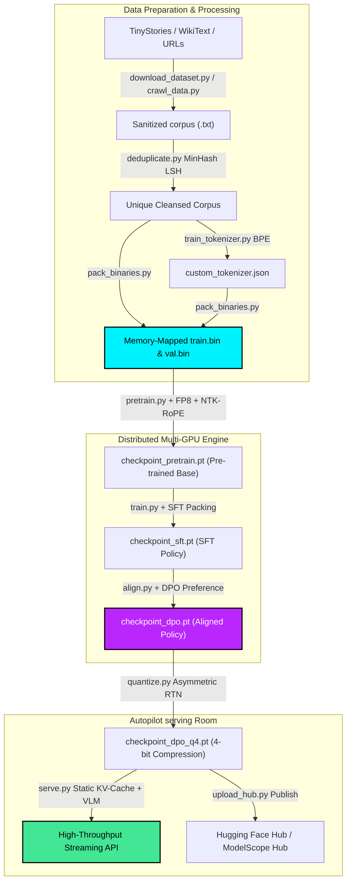
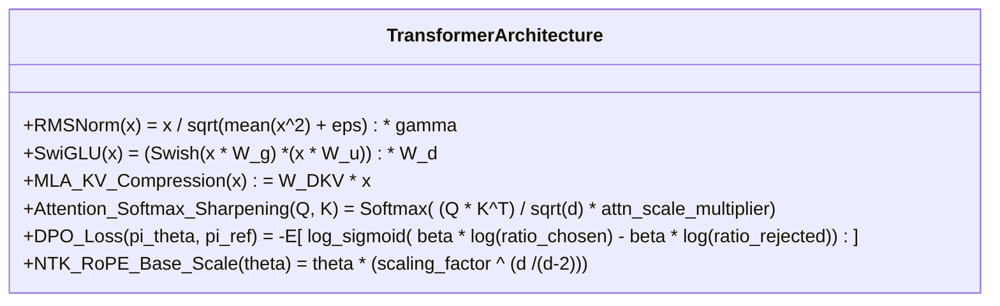
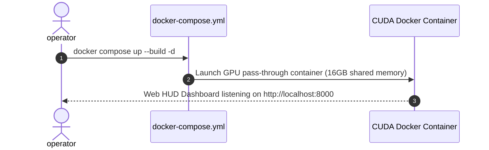
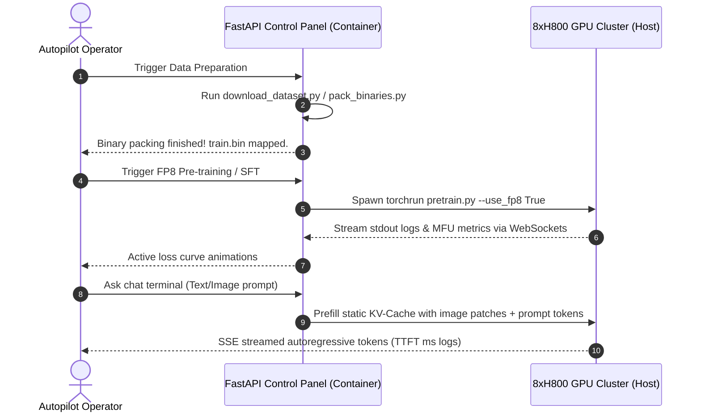

  

# nano-llm: Clean, Minimalist PyTorch LLM Training & Alignment Node

Welcome to **nano-llm** (now upgraded with **nano-deepseek** capabilities)! This repository is a clean, minimal, and highly educational PyTorch implementation for pre-training, Supervised Fine-Tuning (SFT), Preference Alignment (DPO), and long-context/FP8 optimizations of modern LLMs, designed for **8x80GB H800 GPU** clusters.

Read this in other languages: [English](README.md) | [简体中文](README_ZH.md)

---

## 🎨 Master Pipeline & Core Architecture

---

## 📘 Visual blue prints & Architectures

We have organized all documentation into **100% Visual blueprints**, replacing large text blocks entirely with design diagrams:

| Documentation Blueprint | Visual Content Included |
| :--- | :--- |
| 👁️ **[DeepSeek MLA & DeepSeekMoE Blueprint](file:///home/ifnodoraemon/myagent/nano-llm/docs/deepseek_upgrade.md)** | • GQA vs. DeepSeek MLA Memory Flow • Shared + Gated MoE Routing Architecture • UML Class mapping of `model.py` components |
| ⚡ **[Attention & Position Coordinates Blueprint](file:///home/ifnodoraemon/myagent/nano-llm/docs/attention_and_position.md)** | • Softmax Attention Sharpening peaks comparison • NTK-Aware Positional Coordinate stretching • High-Resolution Double-Grid Visual projector flow • Hard Negative SFT Data generation sequence |
| 📈 **[1M Long-Context Blueprint](file:///home/ifnodoraemon/myagent/nano-llm/docs/context_engineering.md)** | • Dynamic NTK phase precompute sequence • KV-Cache memory footprint metrics (GQA vs. MLA) • Ring-Attention Context Parallel circular network • Ring Attention computational loop states |
| 🏎️ **[Performance & Self-Iteration Blueprint](file:///home/ifnodoraemon/myagent/nano-llm/docs/performance_benchmarks.md)** | • Activation Checkpointing forward/backward VRAM graph • FSDP Parameter/Optimizer sharding comparison • Fused AdamW hardware CUDA kernel sweeps • Autonomous Model Self-Play DPO iteration loop • Evaluation Benchmark logics (MMLU, GSM8K, ARC, etc.) |
| 🛡️ **[LLM Risk Mitigation Blueprint](file:///home/ifnodoraemon/myagent/nano-llm/docs/risk_mitigation.md)** | • Loss Spikes & Training Collapse triggers & safeguards • MoE Routing Collapse & Shared Expert Gated router balance • DPO Reward Hacking & KL-regularization sequence loops • FP8 dynamic range mapping underflow/overflow mitigations |

---

## 📂 Project Architecture

```mermaid
graph TD
    classDef file fill:#f3f3f3,stroke:#333,stroke-width:1px,color:#000;
    classDef dir fill:#e2e2e2,stroke:#000,stroke-width:2px,color:#000;
    classDef root fill:#00f2fe,stroke:#005c66,stroke-width:2px,color:#000;

    Root["nano-llm /"]:::root
    
    %% Config and environment
    Root --> DOCKER["Dockerfile / docker-compose.yml <br> (Multi-GPU CUDA host setup)"]:::file
    
    %% Core Model
    Root --> MODEL["model.py <br> (MLA + MoE + FP8 + Checkpointing)"]:::file
    
    %% Main pipelines
    Root --> PRETRAIN["pretrain.py <br> (Causal Pre-training loop)"]:::file
    Root --> TRAIN["train.py <br> (DDP SFT Packing)"]:::file
    Root --> ALIGN["align.py <br> (DPO Alignment)"]:::file
    Root --> SERVE["serve.py <br> (VLM static-cached streaming serving)"]:::file
    
    %% Subfolders
    Root --> UTILS["utils/"]:::dir
    Root --> WEB["web/"]:::dir
    Root --> DOCS["docs/"]:::dir
    
    UTILS --> U1["download_dataset.py"]:::file
    UTILS --> U2["vision_helper.py"]:::file
    UTILS --> U3["upload_hub.py"]:::file
    
    WEB --> W1["Premium glassmorphic web dashboard HUD"]:::file
    
    DOCS --> DOC1["deepseek_upgrade.md"]:::file
    DOCS --> DOC2["attention_and_position.md"]:::file
    DOCS --> DOC3["context_engineering.md"]:::file
    DOCS --> DOC4["performance_benchmarks.md"]:::file
    DOCS --> DOC5["risk_mitigation.md"]:::file
```

---

## 📐 Mathematical Frameworks in Code

---

## 🚀 Quick Start

### A. Environment Spin-Up

### B. Autopilot Web Console Operations Flow

