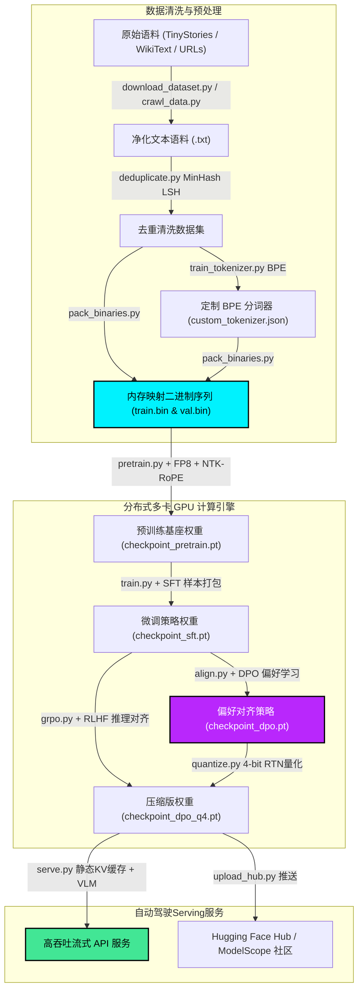
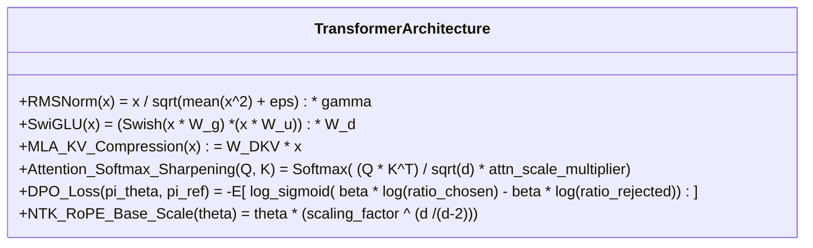
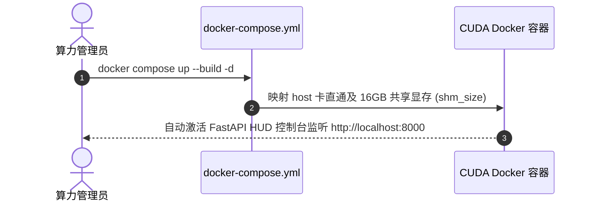
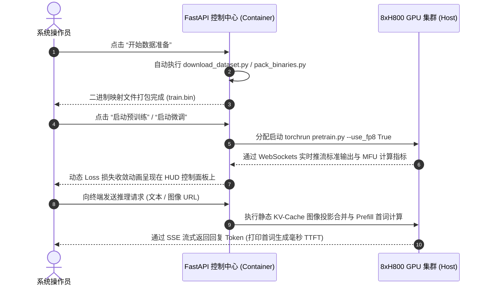
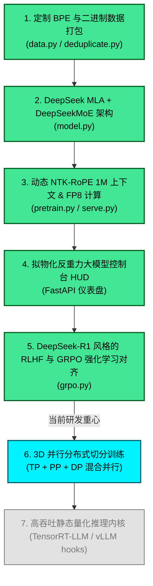

  

# nano-llm: 极简 PyTorch 大语言模型预训练与对齐计算节点

  
  
  
  
  

欢迎来到 **nano-llm**（现已升级 **nano-deepseek** 架构支持）！本仓库是一个纯净、极简且高度模块化的 PyTorch 全流程实现，涵盖现代大语言模型的预训练（Pre-training）、监督微调（SFT）、偏好对齐（DPO）以及百万级长上下文与 FP8 混合精度优化。专为 **8x80GB H800 GPU** 高性能集群设计。

阅读其他语言版本: [English](README.md) | [简体中文](README_ZH.md)

---

## 🎨 核心流水线与分布式架构

---

## 📘 100% 视觉化架构设计蓝图

为了实现最直观的工程掌控力，我们将所有底层技术文档重构为**全视觉图表蓝图**，彻底移除冗长文本：

| 架构技术蓝图 | 图解展示的核心技术设计 |
| :--- | :--- |
| 👁️ **[DeepSeek MLA & DeepSeekMoE 架构蓝图](docs/deepseek_upgrade.md)** | • 标准 GQA 与 DeepSeek MLA 显存读写拓扑对比 • 共享专家与动态门控路由专家的细粒度融合流程 • `model.py` 中神经网络组件的类依赖结构图 |
| ⚡ **[注意力细节与旋转位置坐标优化蓝图](docs/attention_and_position.md)** | • Softmax 熵约束注意力锐化前后概率分布曲线对比 • NTK-Aware Positional 旋转相角微距拉伸原理 • Double-Grid 多网格超分辨率视觉投影器数据流 • Hard Negative 自我迭代时序校验与指令生成闭环 |
| 📈 **[1M 超长上下文工程蓝图](docs/context_engineering.md)** | • 动态 NTK 频率基底预计算流程时序 • 百万 Token 上下文下 GQA 与 MLA 显存开销对比 • 基于 Ring-Attention 的 8 卡 GPU 虚拟环通信拓扑 • 环形注意力异步计算与缓存传递状态机 |
| 🏎️ **[性能指标与自我迭代蓝图](docs/performance_benchmarks.md)** | • 激活检查点（Activation Checkpointing）显存均摊流 • PyTorch FSDP 权重与优化器参数分布式切分状态 • Fused AdamW 硬件 CUDA 单扫（Single-Sweep）提速机制 • 自动化 Self-Play DPO 自我进化与对齐回路流程 • 多榜单评测（MMLU, GSM8K, ARC 等）提取与评分流程 |
| 🛡️ **[LLM 训练风险与对齐规避蓝图](docs/risk_mitigation.md)** | • Loss 骤增与训练收敛崩盘的诱因与四重防御流图 • MoE 路由崩溃与专家闲置的动态门控均衡与共享专家保障 • DPO 偏好对齐奖励黑客与基于 Reference Anchor 的 KL 正则惩罚 • FP8 动态范围截断与溢出噪声的 Tensor-wise 动态比例映射 |
| 🐳 **[Docker Swarm 多机部署与调度蓝图](docs/swarm_multi_node_deployment.md)** | • Swarm 管理节点与工作节点分布式拓扑图 • 节点标签设置与绕过容器虚拟化的 Host 网络映射 • PyTorch `torchrun` 跨多机环境变量配置与容器启动时序 |

---

## 📂 项目代码结构

```mermaid
graph TD
    classDef file fill:#f3f3f3,stroke:#333,stroke-width:1px,color:#000;
    classDef dir fill:#e2e2e2,stroke:#000,stroke-width:2px,color:#000;
    classDef root fill:#00f2fe,stroke:#005c66,stroke-width:2px,color:#000;

    Root["nano-llm /"]:::root
    
    %% 环境与配置
    Root --> DOCKER["Dockerfile / docker-compose.yml <br> (多卡 NVIDIA 容器直通环境)"]:::file
    Root --> SWARM["docker-compose-swarm.yml <br> (Docker Swarm 跨多机部署)"]:::file
    
    %% 模型内核
    Root --> MODEL["model.py <br> (MLA + MoE + FP8 + Checkpointing)"]:::file
    
    %% 主训练管线
    Root --> PRETRAIN["pretrain.py <br> (因果语言模型预训练循环)"]:::file
    Root --> TRAIN["train.py <br> (SFT 分布式多卡打包训练)"]:::file
    Root --> ALIGN["align.py <br> (DPO 分布式偏好对齐)"]:::file
    Root --> GRPO["grpo.py <br> (DeepSeek-R1 GRPO 强化学习对齐)"]:::file
    Root --> SERVE["serve.py <br> (流式高吞吐 VLM 静态缓存推理服务)"]:::file
    
    %% 辅助模块
    Root --> UTILS["utils/"]:::dir
    Root --> WEB["web/"]:::dir
    Root --> DOCS["docs/"]:::dir
    Root --> TESTS["tests/"]:::dir
    
    UTILS --> U1["download_dataset.py"]:::file
    UTILS --> U2["vision_helper.py"]:::file
    UTILS --> U3["upload_hub.py"]:::file
    UTILS --> U4["hub_adapter.py"]:::file
    UTILS --> U5["parallel_3d.py"]:::file
    UTILS --> U6["paged_attention.py"]:::file
    UTILS --> U7["audio_projection.py"]:::file
    UTILS --> U8["grpo_critic.py"]:::file
    UTILS --> U9["triton_fa3.py"]:::file
    UTILS --> U10["kv_eviction.py"]:::file
    UTILS --> U11["search_tree.py"]:::file
    
    WEB --> W1["高端拟物玻璃化控制台前端 (FastAPI HUD)"]:::file
    
    DOCS --> DOC1["deepseek_upgrade.md"]:::file
    DOCS --> DOC2["attention_and_position.md"]:::file
    DOCS --> DOC3["context_engineering.md"]:::file
    DOCS --> DOC4["performance_benchmarks.md"]:::file
    DOCS --> DOC5["risk_mitigation.md"]:::file
    DOCS --> DOC6["swarm_multi_node_deployment.md"]:::file

    TESTS --> T1["test_model.py"]:::file
    TESTS --> T2["test_data.py"]:::file
    TESTS --> T3["test_grpo.py"]:::file
    TESTS --> T4["test_upgrades.py"]:::file
    TESTS --> T5["test_search_eviction.py"]:::file
```

---

## 📐 数学算子在代码中的硬核实现

---

## 🚀 容器快速启动

### A. GPU 直通环境拉起

### B. 控制台自动驾驶流水线

---

## 🗺️ 项目技术路线图与重要里程碑 (Visual Roadmap)

---

## 💖 您的支持是我们开源的动力 (Show Your Support)

我们致力于打造全世界最纯净、最高性能、最易于学术与工程理解的纯 PyTorch 大模型预训练与对齐实现。如果您觉得这个项目对您有帮助，**请为我们点亮一颗 Star！** 您的支持是鼓励我们不断迭代和开源更强大功能的最大动力。⭐

