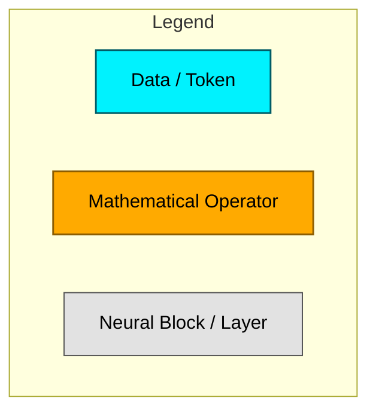
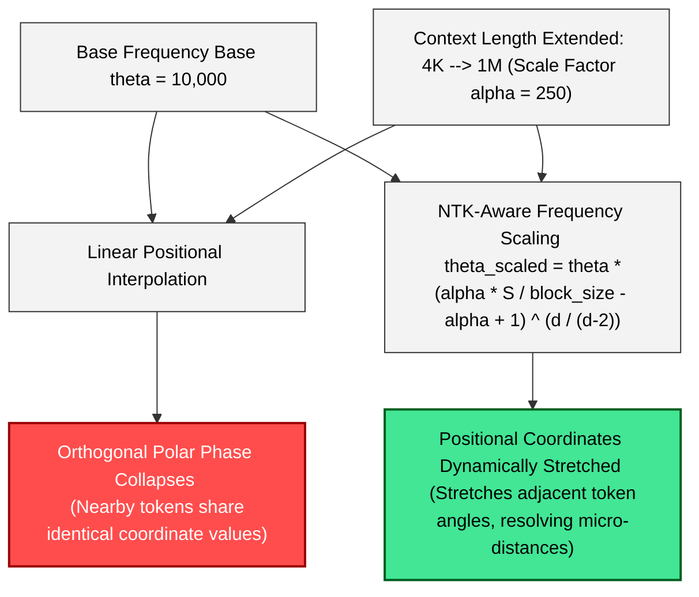
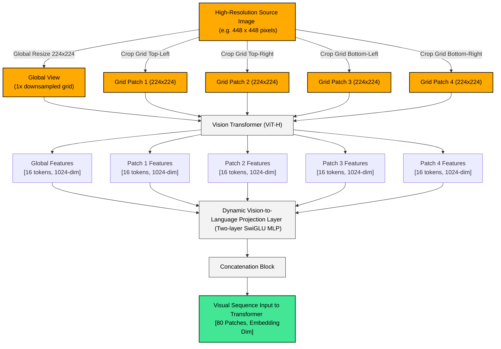
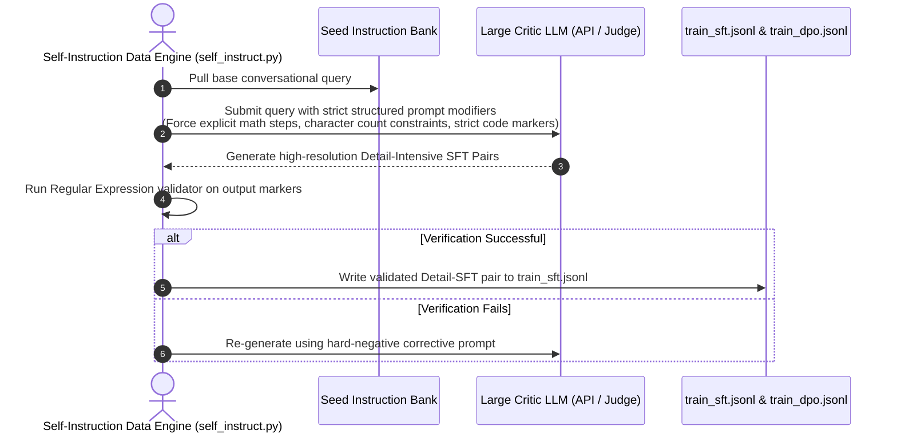

# Attention Detail & Position Coordinates Optimization Blueprint



---

## ⚡ 1. Softmax Attention Sharpening (熵约束注意力)

### Standard Attention Logits Scaling vs. Sharpened Attention

```mermaid
graph TD
    classDef logits fill:#00f2fe,stroke:#000,stroke-width:1px,color:#000;
    classDef opt fill:#ffaa00,stroke:#8c5d00,stroke-width:2px,color:#000;
    classDef distribution fill:#ff4d4d,stroke:#990000,stroke-width:1.5px,color:#fff;
    classDef sharpened fill:#42e695,stroke:#005c1e,stroke-width:2.5px,color:#000;

    Q["Query Vector (Q)"] & K["Key Vector (K)"] --> MatMul["QK^T (Matrix Product)"]:::opt
    
    %% Standard Path
    MatMul -->|Divide by sqrt(d)| RawLogits["Standard Attention Logits"]:::logits
    RawLogits --> Softmax1["Standard Softmax(x)"]:::opt
    Softmax1 --> FlatDist["Entropy Dilution: Flat, Wide Probability Curve <br> (Attention scattered across irrelevant tokens)"]:::distribution

    %% Sharpened Path
    MatMul -->|Divide by sqrt(d) * gamma (gamma = 1.3)| SharpLogits["Sharpened Attention Logits"]:::logits
    SharpLogits --> Softmax2["Standard Softmax(x)"]:::opt
    Softmax2 --> SharpDist["Entropy Compression: High, Narrow Peak <br> (Attention mathematically focused on precision tokens)"]:::sharpened
```

---

## 📐 2. Positional Coordinate Stretching (Decoupled RoPE Base Scaling)



---

## 👁️ 3. Multimodal Detail Ingestion: Double-Grid Visual Projector



---

## 🤖 4. Data-Engine Detail Injection: Hard Negative Prompting


