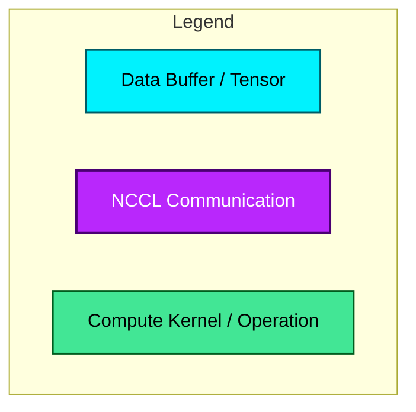
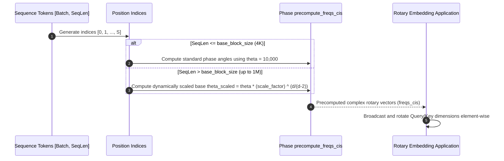
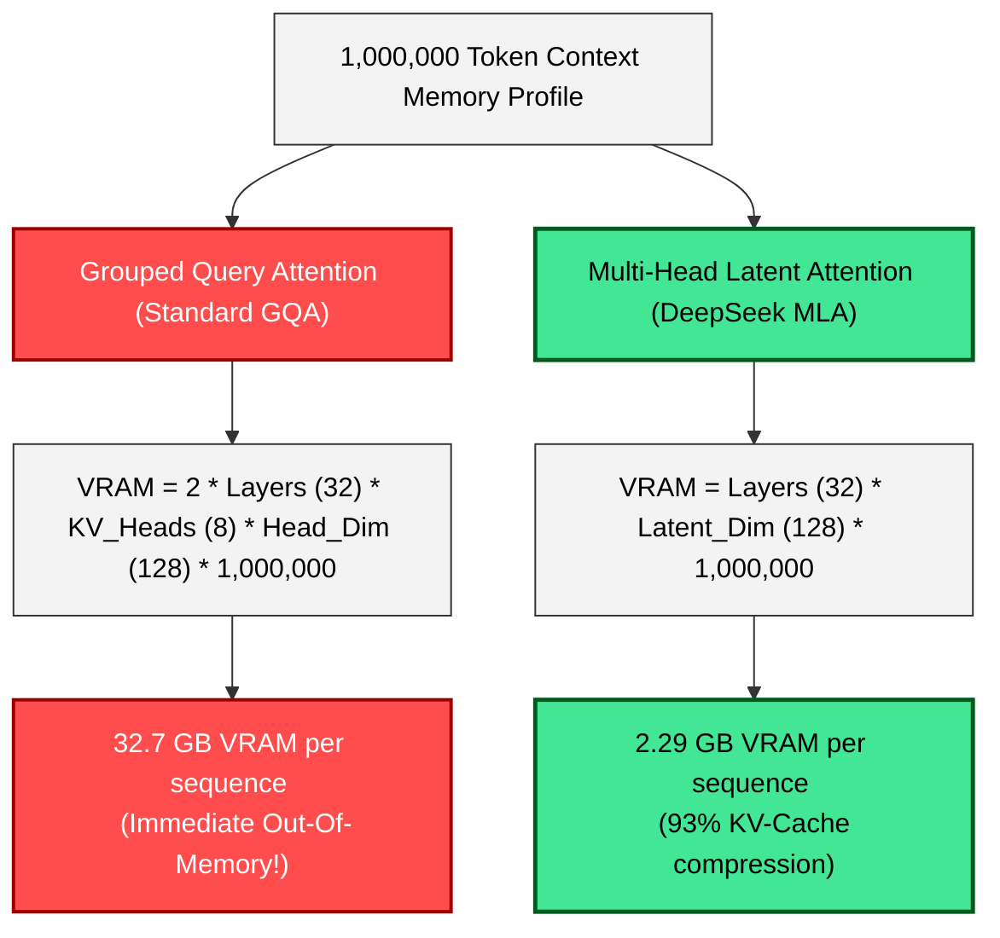
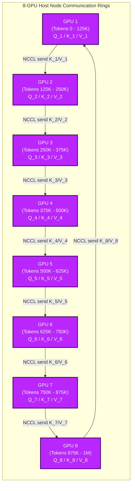
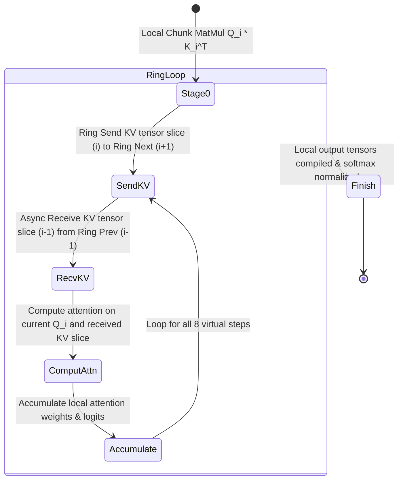

# 1M Long-Context Engineering Blueprint

---

## 📈 1. Dynamic NTK-Aware RoPE Scaling Sequence

---

## 💾 2. KV-Cache Memory Footprint: GQA vs. DeepSeek MLA

---

## 🔀 3. Context Parallelism (Ring-Attention Virtual GPU Ring)

During the multi-GPU attention forward pass, the 1M token sequence is distributed across all 8 GPUs ($125,000$ tokens per GPU). The GPUs continuously stream Keys and Values in a circular ring topology using async NCCL P2P operations:

### The Ring Attention Computational Steps (Asynchronous Loop)

