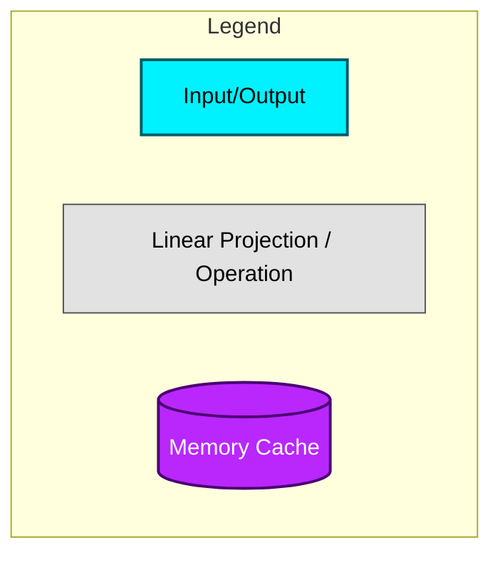
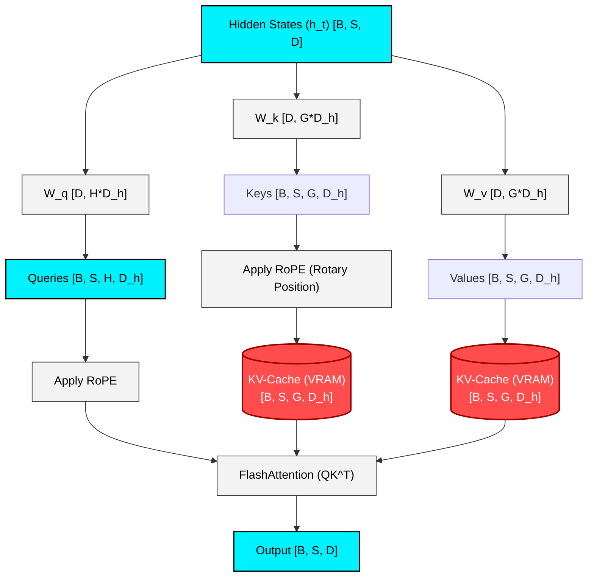
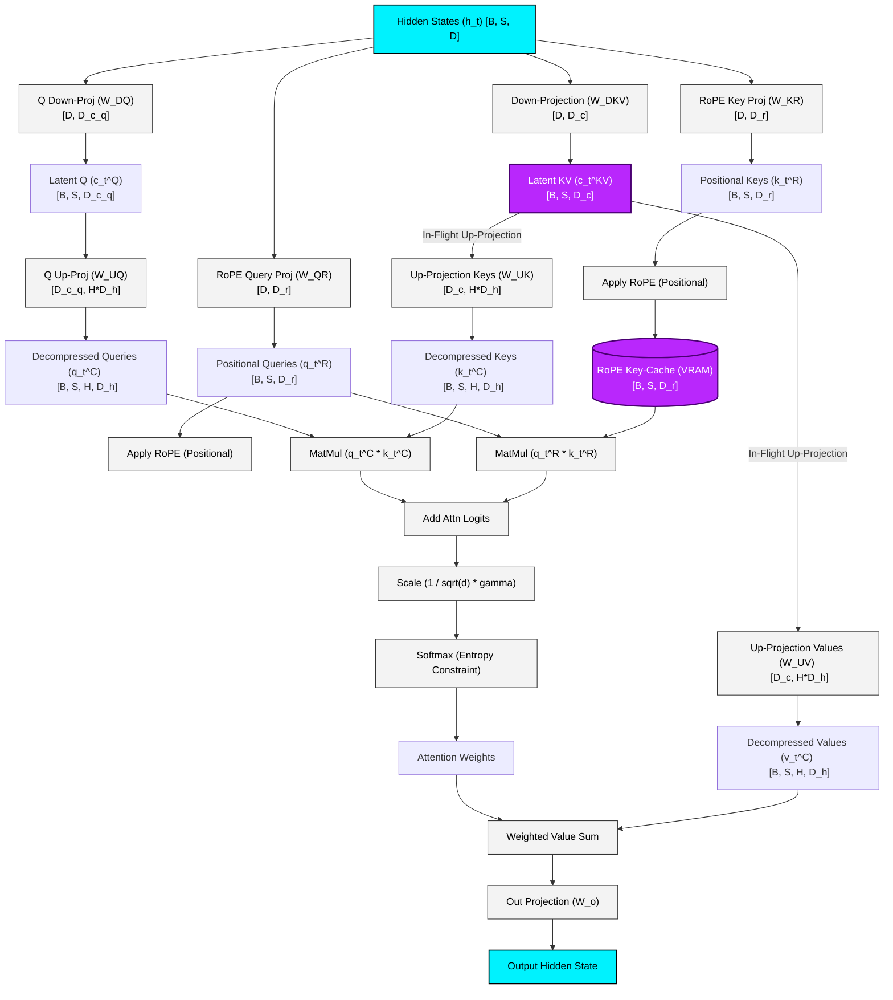
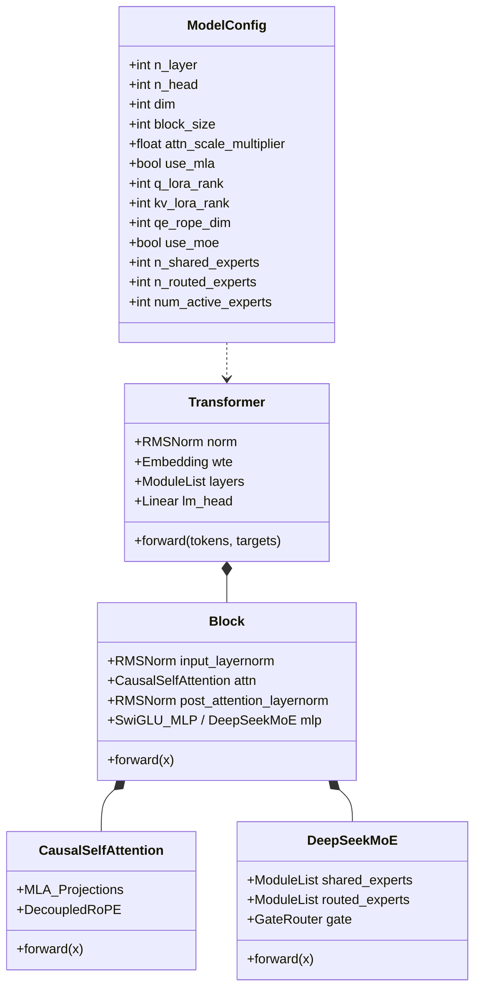

# DeepSeek MLA & DeepSeekMoE Architecture Blueprint



---

## 👁️ 1. GQA (Grouped Query Attention) vs. DeepSeek MLA (Multi-Head Latent Attention)

### A. Grouped Query Attention (Standard LLaMA)



### B. DeepSeek MLA (Compressed KV-Cache & Decoupled RoPE)



---

## 🔀 2. DeepSeekMoE (Mixture of Experts) Architecture

```mermaid
graph TD
    classDef input fill:#00f2fe,stroke:#000,stroke-width:1.5px,color:#000;
    classDef process fill:#f3f3f3,stroke:#333,stroke-width:1px,color:#000;
    classDef expert fill:#42e695,stroke:#005c1e,stroke-width:2px,color:#000;
    classDef router fill:#ffaa00,stroke:#8c5d00,stroke-width:2px,color:#000;

    X["Token Representation (x)"]:::input
    
    %% Split to Shared and Routed pathways
    X --> Shared1["Shared Expert 1 <br> (Always Active SwiGLU)"]:::expert
    X --> Shared2["Shared Expert 2 <br> (Always Active SwiGLU)"]:::expert
    
    X --> Router["Gated Router Module <br> (Softmax + Top-K Filtering)"]:::router
    
    %% Router selection
    Router -->|Gate Score g_1| E1["Routed Expert 1"]:::expert
    Router -->|Gate Score g_2| E2["Routed Expert 2"]:::expert
    Router -->|Gate Score g_3| E3["Routed Expert 3"]:::expert
    Router -->|Gate Score g_N| En["Routed Expert N"]:::expert
    
    %% Dynamic Masking based on Top-2
    Router -.->|Dynamic Routing Mask| Switch1["Expert Gate Switch"]:::router
    Switch1 -->|y_1 = g_1 * E_1(x)| SumRouted["Sum of Top-K Routed Outputs"]:::process
    Switch1 -->|y_2 = g_2 * E_2(x)| SumRouted
    
    Shared1 & Shared2 --> SumShared["Sum of Shared Outputs"]:::process
    
    %% Blend everything
    SumShared & SumRouted --> Blend["Add Outputs"]:::process
    Blend --> Output["Output Token y"]:::input
```

---

## ⚙️ 3. Structural Mapping in Code


