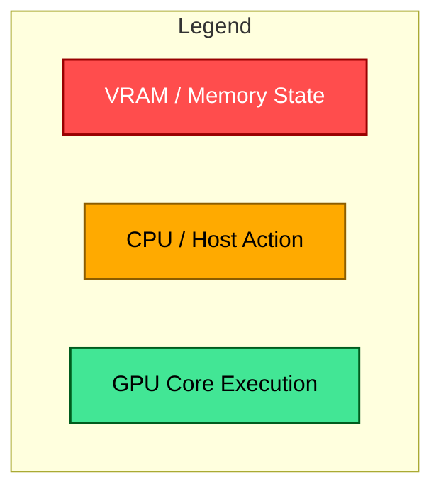
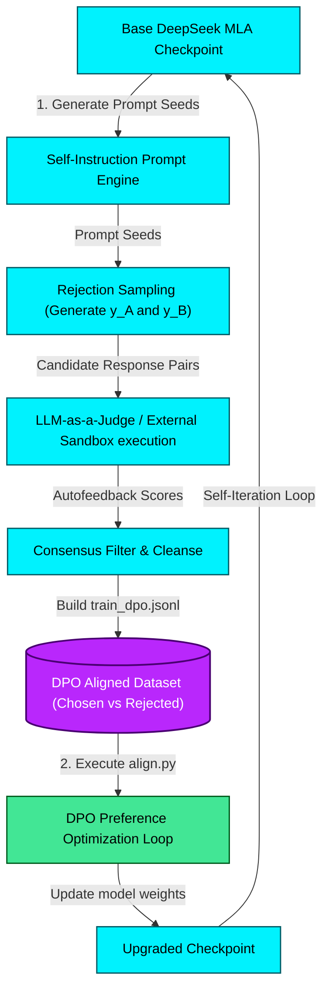
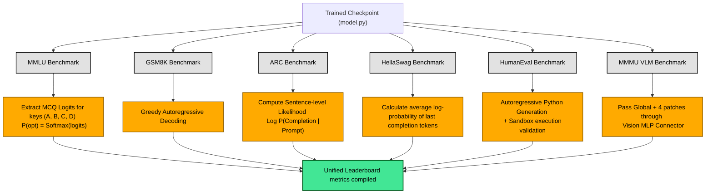

# Performance Benchmarks & Self-Iteration Optimization Blueprint



---

## ⚡ 1. Activation Checkpointing: VRAM Memory Profile


---

## 🔀 2. FSDP (Fully Sharded Data Parallel) Memory Allocation

```mermaid
graph LR
    classDef replica fill:#ff4d4d,stroke:#990000,stroke-width:1.5px,color:#fff;
    classDef shard fill:#42e695,stroke:#005c1e,stroke-width:1.5px,color:#000;

    subgraph Standard DDP (Model Replication on 8 GPUs)
        GPU1_ddp["GPU 1: Full Model [14GB] + Full Optimizer States [56GB]"]:::replica
        GPU2_ddp["GPU 2: Full Model [14GB] + Full Optimizer States [56GB]"]:::replica
        GPU8_ddp["GPU 8: Full Model [14GB] + Full Optimizer States [56GB]"]:::replica
    end

    subgraph PyTorch FSDP (Sharded Parameters & Optimizer)
        GPU1_fsdp["GPU 1: 1/8 Model Shard [1.7GB] + 1/8 Optimizer Shard [7GB]"]:::shard
        GPU2_fsdp["GPU 2: 1/8 Model Shard [1.7GB] + 1/8 Optimizer Shard [7GB]"]:::shard
        GPU8_fsdp["GPU 8: 1/8 Model Shard [1.7GB] + 1/8 Optimizer Shard [7GB]"]:::shard
    end
```

---

## 🏎️ 3. Hardware Optimization: Fused AdamW CUDA Sweeping

```mermaid
graph TD
    classDef memory fill:#ffaa00,stroke:#8c5d00,stroke-width:1.5px,color:#000;
    classDef kernel fill:#42e695,stroke:#005c1e,stroke-width:2px,color:#000;
    classDef bad fill:#ff4d4d,stroke:#990000,stroke-width:1.5px,color:#fff;

    subgraph Standard AdamW (High Memory Traffic)
        Step1["Read weights, gradients, momentums from HBM to SRAM"]:::memory
        Step1 --> CalcMomentum["Compute First Moment (m_t)"]:::bad
        CalcMomentum --> WriteHBM1["Write m_t back to HBM"]:::memory
        WriteHBM1 --> Step2["Read m_t and weights from HBM to SRAM"]:::memory
        Step2 --> CalcVariance["Compute Second Moment (v_t)"]:::bad
        CalcVariance --> WriteHBM2["Write v_t back to HBM"]:::memory
        WriteHBM2 --> Step3["Read v_t, m_t, and weights from HBM to SRAM"]:::memory
        Step3 --> ApplyUpdate["Apply weight update step"]:::bad
        ApplyUpdate --> WriteHBM3["Write updated weights to HBM"]:::memory
    end

    subgraph Fused AdamW (Single-Sweep CUDA Kernel)
        Step1_f["Read weights, gradients, momentums, variances from HBM once"]:::memory
        Step1_f --> FusedKernel["Fused CUDA Kernel Sweep <br> (Compute m_t + v_t + Apply Update in GPU Registers)"]:::kernel
        FusedKernel --> WriteHBM_f["Write updated weights to HBM once"]:::memory
    end
```

---

## 🔄 4. Autonomous Model Self-Iteration Protocol



---

## 📈 5. Multi-Benchmark Evaluation Logic


