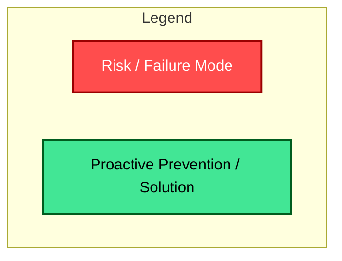
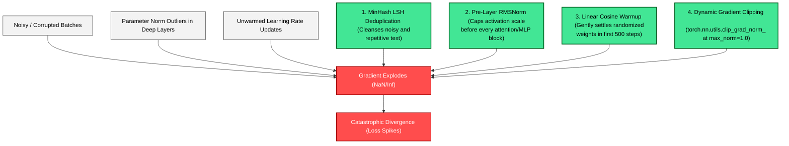
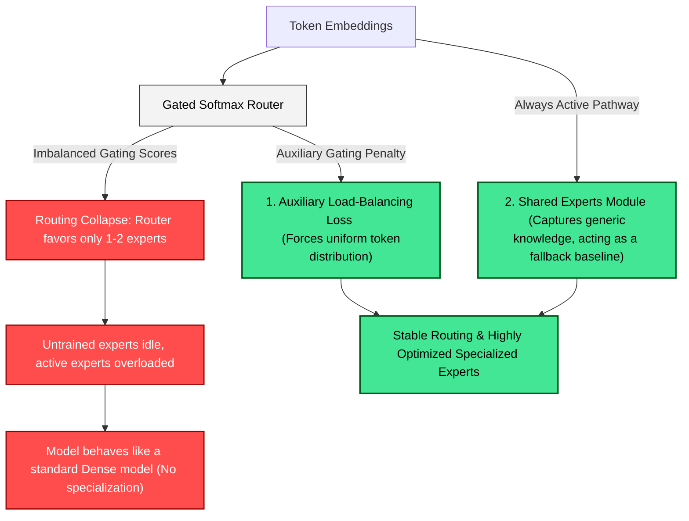
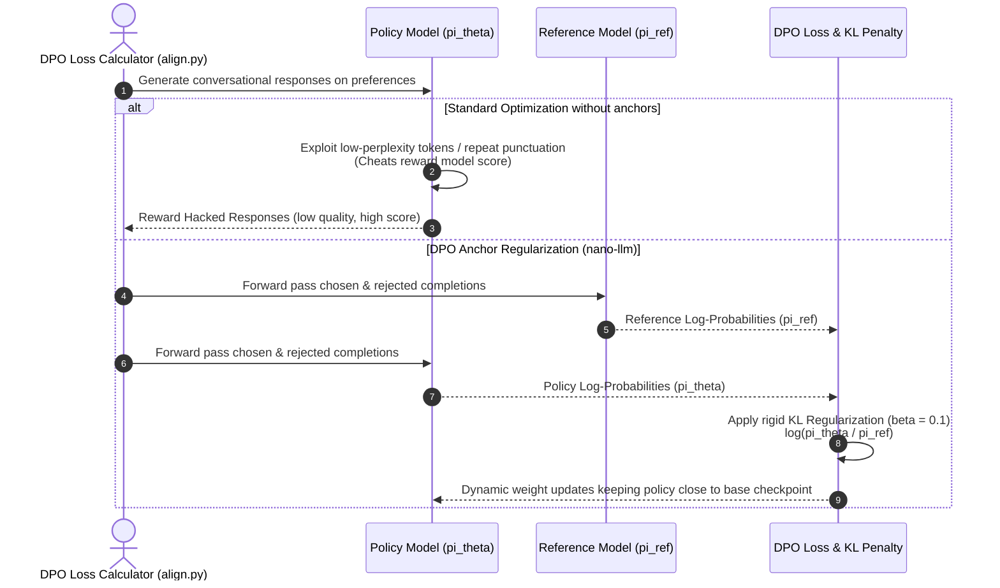
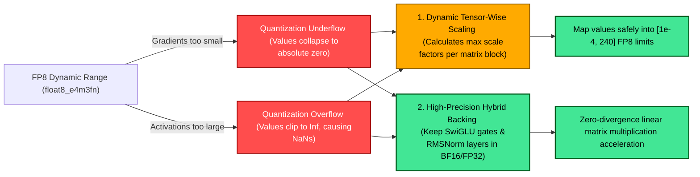

# LLM Training Risks & Mitigation Blueprint

---

## 💥 Risk 1: Loss Spikes & Training Collapse (训练崩盘 / 损失骤增)

---

## 🔀 Risk 2: MoE Expert Collapse & Load Balancing (路由坍坍 / 专家闲置)

---

## 🤖 Risk 3: Reward Hacking & Alignment Degeneracy in DPO (奖励黑客)

---

## 💾 Risk 4: FP8 Dynamic Range Underflow/Overflow (FP8 截断与溢出)

