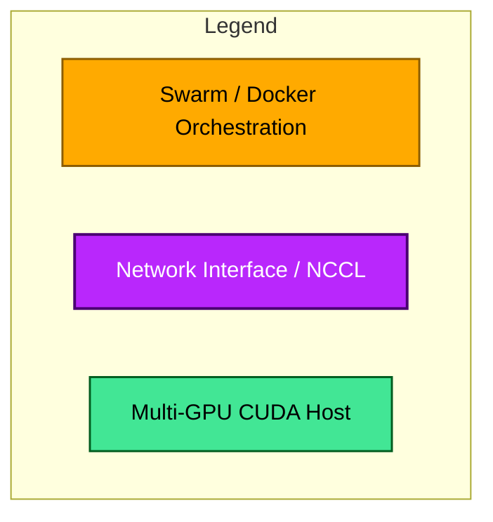
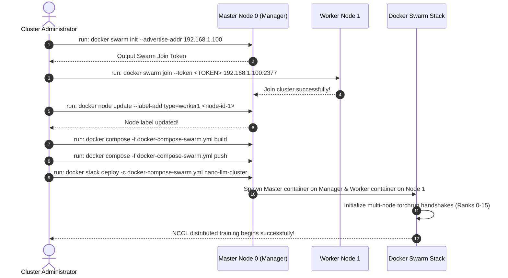
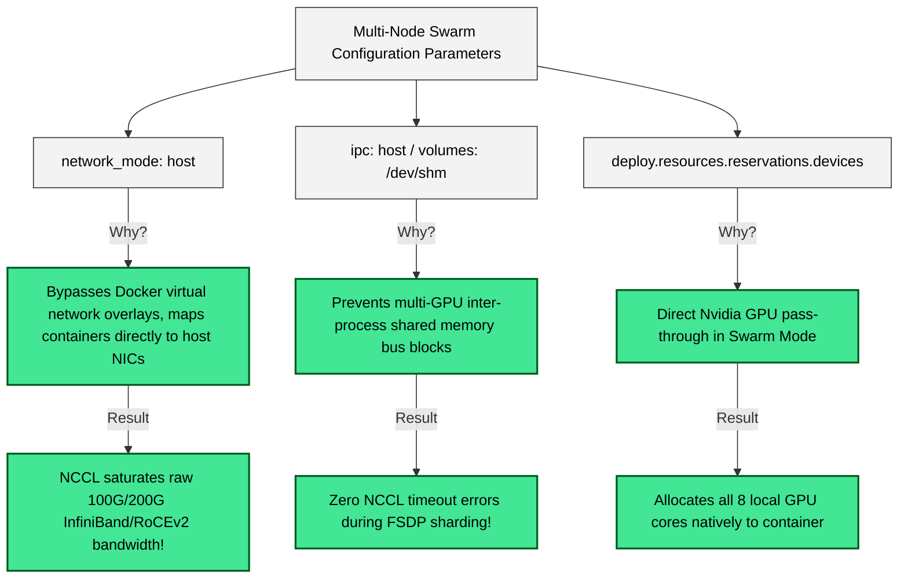

# Docker Swarm Multi-Node GPU cluster Deployment Blueprint



---

## 👁️ 1. Multi-Node distributed Topology (Swarm Manager vs. Workers)

```mermaid
graph TD
    classDef manager fill:#ffaa00,stroke:#000,stroke-width:2px,color:#000;
    classDef worker fill:#e2e2e2,stroke:#000,stroke-width:1.5px,color:#000;
    classDef net fill:#b927fc,stroke:#4a0072,stroke-width:2px,color:#fff;

    %% Nodes
    Master["Master Node 0 (Swarm Manager) <br> IP: 192.168.1.100 <br> 8x H800 (Ranks 0-7)"]:::manager
    Worker1["Worker Node 1 (Swarm Worker) <br> IP: 192.168.1.101 <br> 8x H800 (Ranks 8-15)"]:::worker
    
    %% Communication
    Master -->|1. Swarm Overlay Network Control| Worker1
    
    %% NCCL Data Flow
    Master <-->|2. High-Speed InfiniBand / RoCEv2 <br> (Host Network Mode bypasses virtualization!)| NetPipe["NCCL Multi-Node P2P Ring"]:::net
    Worker1 <-->|2. High-Speed InfiniBand / RoCEv2| NetPipe
```

---

## 🚀 2. Step-by-Step Deployment Protocol



---

## ⚙️ 3. Critical Network & VRAM Configurations


